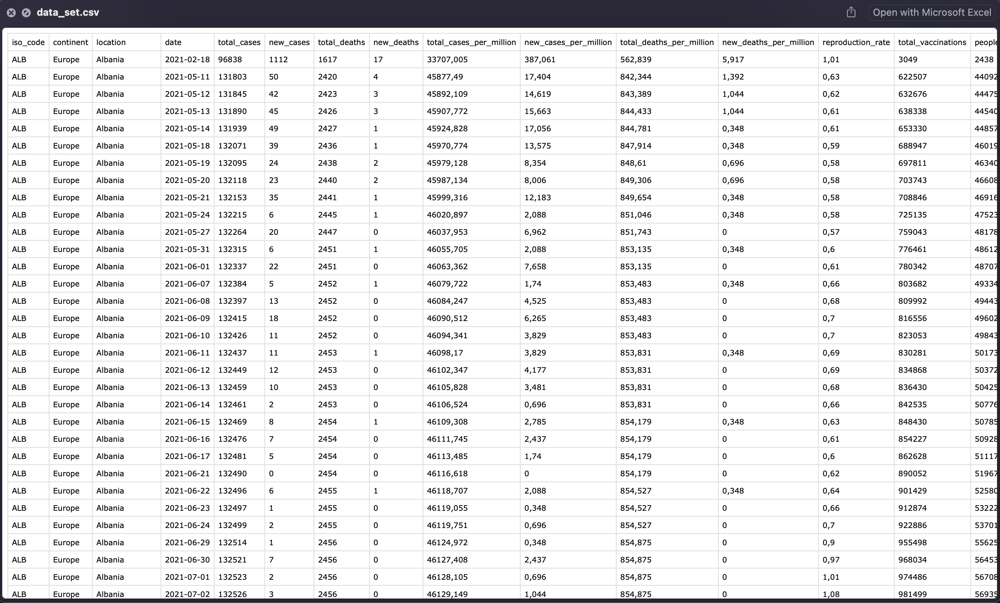
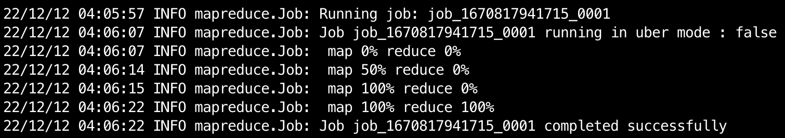
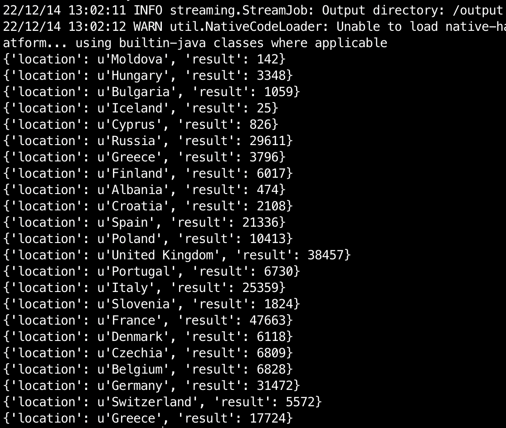

# MapReduce
## Hadoop MapReduce Python 

Подсчет количества заражений (COVID19) за день по странам Европы  
Counting the number of infections (COVID19) per day for European countries  

### Data set

### Processing

### Result

